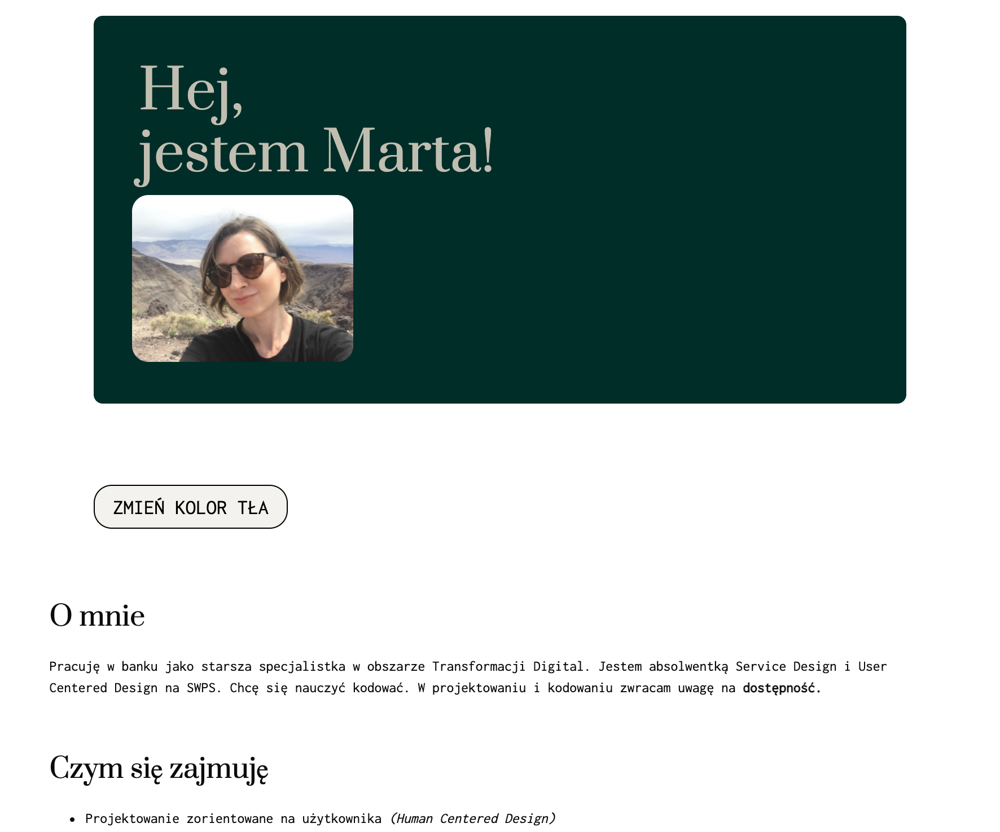

# Marta Szymborska - moja strona
##Demo
https://martaszymborska.github.io/homepage/
## Opis
My first adventure with coding.  Site was preapred during first weeks of YouCode course. It contains my short description (education, work experience, hobby).
What I was learning:
- HTML
- CSS stuling 
- BEM convention
- simple interaction in JS
It's not perfect yet, but I'm proud :)

